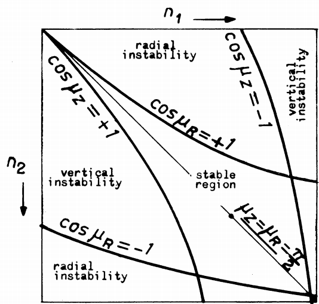

---
header-includes:
   - \usepackage[margin=1.0in]{geometry}
---

\begin{center}
\textbf{\huge Alternating Gradient Quadrupole Magnets in Particle Accelerators} \newline \newline \newline \newline
\end{center} 

\textbf{\Large{Abstract}}

This paper examines how alternating gradient quadrupole magnets are used to focus beams of particles in circular high energy particle accelerators. After an introduction of basic concepts, this paper will mathematically describe the motion and stability of particle orbits in an accelerator. Many circular accelerators use a series of alternating gradient quadrupoles for beam focusing which causes the particles to have some oscillatory motion. The equations for this motion are derived in the first section of this paper using a linear approximation. This is followed by a discussion of the conditions for stability of the particle's oscillatory motion. The conditions for the stability of particle oscillations is then derived. This paper examines the theory and discusses the application of strong focusing, a technique used in many circular particle accelerators. \newline \newline \newline \newline

\textbf{\Large{Introduction}}

In circular particle accelerators, the particles are confined to circular orbits with strong focusing quadrupole magnets. The quadrupole magnets exert a linear restoring force on the particles. A quadrupole magnet will focus a beam of particles in the horizontal plane and defocus the beam in the vertical plane, or vice versa. To compensate for this, accelerator rings have a series of alternating focusing and defocusing quadruple magnets that have a net focusing effect on the beam [1]. For this reason, these kinds of accelerators are also referred to as alternating gradient machines. Alternating gradient machines are used because the mean deviation of the synchronous orbit from the ideal orbit is much smaller in an alternating gradient machine than in a constant gradient machine [2].

![Quadrupole Magnetic Field][qpole]

[qpole]: qpole.png

This magnetic focusing is illustrated by Figure 1 [3]. Figure 1 shows the magnetic fields of alternating gradient quadrupoles. In order to change the gradient of the magnet, the north and south poles are switched. The red ovals are representative of particle beams being vertically and horizontally focused by the magnets. The particles get repeatedly focused and unfocused in the vertical and horizontal axes.

Figure 2 is an image of a real-life quadrupole magnet. This magnet is called HQ02a, and was developed at Fermilab.

These quadrupole magnets go inside circular particle accelerators, such as the CERN Super Proton Synchrotron, shown in Figure 3 [4].

This paper will examine the motion and oscillations of particles in a circular accelerator that undergo alternate gradient focusing. We will start by deriving the equations of motion for the particles. \newline \newline

\textbf{\Large{Equations of Motion for Particle Beams}}

The equations of motion of the particles in an accelerator can be described with a linear approximation. This can be done using the following curvilinear coordinates [2]:

$s$ is the distance along the equilibrium orbit measured from some fixed reference point to that point on the orbit closest to the point $P$.

$x$ is the horizontal component of the displacement of $P$ from the equilibrium orbit (taken to be positive in the outward direction)

$z$ is the vertical component of the displacement

The equations of motion for a particle in orbit are:

$$\frac{d^2x}{ds^2} = -\frac{1-n(s)}{\rho^2(s)}x$$

$$\frac{d^2z}{ds^2} = -\frac{n(s)}{\rho^2(s)}z$$

Where $n$ is the field gradient index, defined as

$$n=-\frac{r}{B}\frac{\partial B}{\partial r}$$

$\rho(s)$ is the radius of curvature of the equilibrium orbit at $s$, defined as

$$\rho(s) = \frac{pc}{eB_z (s,0,0)}$$

and $n(s)$ is the field gradient at $s$ defined as

$$n(s) = - \frac{\rho^2}{pc/e} \frac{\partial B_z}{\partial x}$$

These equations of motion are periodic and satisfy Hill's equation. The equations of motion are generally non-linear, but in order to do a linear approximation one can keep only the lowest order terms of $x$ and $y$. Then, the equations of motion can be written in the form:

$$\frac{d^2y}{ds^2} = -K(s)y$$

where $y$ is the horizontal or vertical displacement, $K$ satisfies: $K(s+L) = K(s)$ and $L=\frac{C}{N}$ where $C$ is the circumference of the particle's orbit, and $N$ is a number of identical sections or "unit cells" in the accelerator.

In an accelerator, $K$ is usually constant by design, so only constant values of $K$ will be considered in finding solutions to the equations of motion. If you solve this linear second order differential equation for the case of $K$ being a positive constant and put it in matrix form you get:

$$
\left(\begin{array}{cc}
y \\
y'
\end{array}\right)_0
\left(\begin{array}{cc}
cos(\sqrt{K}l) & \frac{sin(\sqrt{K}l)}{\sqrt{K}} \\
-\sqrt{K}sin(\sqrt{K}l) & cos(\sqrt{K}l)
\end{array}\right)=
\left(\begin{array}{cc}
y \\
y'
\end{array}\right)
$$

for some distance $l$. If $K$ is negative you get the matrix:

$$
\left(\begin{array}{cc}
y \\
y'
\end{array}\right)_0
\left(\begin{array}{cc}
cosh(\sqrt{K}l) & -\frac{sinh(\sqrt{|K|}l)}{\sqrt{|K|}} \\
-\sqrt{|K|}sinh(\sqrt{|K|}l) & cosh(\sqrt{K}l)
\end{array}\right)=
\left(\begin{array}{cc}
y \\
y'
\end{array}\right)
$$

Or for the simplest case in which $K=0$, the matrix is:

$$
\left(\begin{array}{cc}
y \\
y'
\end{array}\right)_0
\left(\begin{array}{cc}
1 & l \\
0 & 1
\end{array}\right)=
\left(\begin{array}{cc}
y \\
y'
\end{array}\right)
$$

These first two solutions describe the oscillatory motions of a particle as it goes through the focusing and defocusing magnets. The third matrix corresponding to $K=0$ describes the particle's motion as it goes through the drift space between magnets [2].

These matrices can be defined as [5]:

$$
M_+ = \left(\begin{array}{cc}
cos(\sqrt{K}l) & \frac{sin(\sqrt{K}l)}{\sqrt{K}} \\
-\sqrt{K}sin(\sqrt{K}l) & cos(\sqrt{K}l)
\end{array}\right)
$$

$$
M_- = \left(\begin{array}{cc}
cosh(\sqrt{K}l) & -\frac{sinh(\sqrt{|K|}l)}{\sqrt{|K|}} \\
-\sqrt{|K|}sinh(\sqrt{|K|}l) & cosh(\sqrt{K}l)
\end{array}\right)
$$

and $M = M_+M_-$.

A "period" or "unit cell" can be considered as one focusing and defocusing sector, then the values of $y$ and $y'$ at the end of a period can be written as a function of the values of $y$ and $y'$ at the beginning of a period:

$$
\left(\begin{array}{cc}
y \\
y'
\end{array}\right)_t = M_+M_-
\left(\begin{array}{cc}
y \\
y'
\end{array}\right)_0 = M
\left(\begin{array}{cc}
y \\
y'
\end{array}\right)_0
$$

These matrices are encountered repeatedly and represent the motion of the particles all the way around the accelerator. The image below shows a schematic representation of the effects of alternating gradient magnets. The blue lines represent approximate particle trajectories. The section below the blue band that says "cell" is one repeated "unit cell". This arrangement is oftern referred to as a FODO lattice [6]. \newline \newline \newline

 

\textbf{\Large{Stability of Particle Oscillations}}

In order to maintain a particle beam in a circular accelerator, the particle oscillations must remain stable. Mathematically, this condition is that the value of $$M^n\left(\begin{array}{cc}
y \\
y'
\end{array}\right)$$

must remain finite as $n$ becomes arbitrarily large. Physically, $n$ represents the number of times a beam of particles passes through a unit cell [2].

The regions of stability and instability can be found mathematically in terms of the magnetic index for consecutive unit cells. To do this, start by considering the eigenvalues of the matrix $M$, which can be written as $$\lambda_{\pm} = e^{\pm i \mu}$$

For simplicity, $M$ can be set to $$M = \left(\begin{array}{cc}
a & b \\
c & d
\end{array}\right)$$

Then solving the eigenvalue equation yields:

$$det(M-\lambda I) = 0$$ $$(ad-bc) - (a+d)\lambda + \lambda^2 = 0$$

Note that $M$ is unimodular because $n(s)$ and $\rho(s)$ do not have any first derivative terms. The determinant of $M$ $(ad-bc)$ can be set to one in this equation. Then the eigenvalue equation becomes 

$$1 - (a+d)\lambda + \lambda^2 = 0$$ $$\lambda^{-1} + \lambda = a+d$$

Note that $(a+d)$ is the trace of $M$. Plugging in the exponential values for the eigenvalues and rewriting them in sinusoidal terms:

$$e^{i\mu} + e^{-i\mu} = cos(\mu) + isin(\mu) + cos(-\mu) + isin(-\mu) = 2cos(\mu) = Tr(M)$$

The stability condition is [2]: 

$$-1 \leq cos(\mu) = \frac{1}{2}Tr(M) \leq 1$$

Now we can introduce some new parameters referred to as Twiss parameters:

$$\beta(s) = \omega^2(s)$$

$$\alpha(s) = -\frac{1}{2} \frac{d\beta(s)}{ds}$$

where $\omega(s)$ is a periodic function [7].

Going back to the equation of motion:

$$\frac{d^2y}{ds^2} = -K(s)y$$

Note that a general solution of this equation can be expressed in the form:

$$y = \sqrt{\beta(s)}cos(\psi(s))$$

Now we can write a transport matrix for a particle going from position $s_0$ to $s_0 + C$ where $C$ is one repeat period.

$$\left(\begin{array}{cc}
y \\
y'
\end{array}\right)_{s_0 + C} =  \left(\begin{array}{cc}
a & b \\
c & d
\end{array}\right) \left(\begin{array}{cc}
y \\
y'
\end{array}\right)_{s_0}$$

Solving for $a,b,c$ and $d$ is quite complicated (see reference 8), but eventually one gets the solution:

$$\left(\begin{array}{cc}
cos(\psi) + \alpha sin(\psi) & \beta sin(\psi) \\
-\frac{1+\alpha^2}{\beta}sin(\psi) & cos(\psi) - \alpha sin(\psi)
\end{array}\right)$$

This is sometimes referred to as the Twiss matrix. Here $\psi$ is called the phase advance and is defined as:

$$\psi = \int_{s_{0}}^{s_{0}+C} \frac{1}{\beta(s)} ds$$

and $\beta(s)$ is the local wavelength of the oscillation divided by $2\pi$.

In the case of a circular accelerator, the total phase advance for a complete revolution is: 

$$\nu = \frac{1}{2\pi} \oint \frac{ds}{\beta}$$

where $\nu$ is the total number of oscillations for one revolution around the accelerator, referred to as the "tune" of the accelerator [8].

If we define a new matrix $J$ as 

$$J = \left(\begin{array}{cc}
\alpha & \beta \\
-\gamma & -\alpha
\end{array}\right)$$ 

where 

$$\gamma = \frac{1+\alpha^2}{\beta}$$

The matrix solution can be written as:

$$Icos(\psi) + Jsin(\psi)$$ 

where $I$ is the identity matrix [2]. Now we can show that the relation of $cos(\psi)$ and $TrM$ is identical to the stability condition for $\mu$. This is done by equating the two forms of the matrix $M$:

$$\left(\begin{array}{cc}
a & b \\
c & d
\end{array}\right)=\left(\begin{array}{cc}
cos(\psi) + \alpha sin(\psi) & \beta sin(psi) \\
-\gamma sin(\psi) & cos(\psi) - \alpha sin(\psi)
\end{array}\right)$$

which yields the relation 

$$cos(\psi) = \frac{1}{2}TrM$$

Therefore $\mu$ is the phase advance through one repeat period.[8] We can now rewrite the matrix $M$ as:

$$M = Icos(\mu) + Jsin(\mu)$$ 

The $kth$ power of the matrix $M$ is:

$$M^k = Icos(k\mu) + Jsin(k\mu)$$

This expression has properties similar to the complex exponential $e^{ik\mu} = cos(k\mu) + isin(k\mu)$. If follows from this and the expression for $M^k$ that if $\mu$ is complex, $M^k$ will increase indefinitely with increasing $k$, and if $\mu$ is real $M^k$ will oscillate and not increase indefinitely with increasing $k$. Therefore, the particle motion is stable if $\mu$ is real, and unstable if $\mu$ is complex [2].

Figure 4 shows the region of stability for radial and vertical oscillations [5]. In Figure 4 $n_1$ and $n_2$ are the values of the magnetic index in consecutive unit cells. The stability is at a maximum for $n_1 = n_2$. In this figure $\mu_z$ and $\mu_r$ correspond to the vertical and radial phase advances, respectively. There is vertical instability outside the curves corresponding to $cos(\mu_z) = 1$ and $cos(\mu_z) = -1$ and there is radial instability outside the curves corresponding to $cos(\mu_r) = 1$ and $cos(\mu_r) = -1$. In the center of the stability region, $cos(\mu_z) = cos(\mu_r) = 0$ and $\mu_z = \mu_r = 0$. This corresponds to four magnetic periods per betatron wavelength. Within the region of stability, the oscillations take the form of sinusoidal curves with small periodic wriggles. In most cases, these wriggles are small compared to the sinusoidal oscillations [5].

Consider a real accelerator, such as the Large Hadron Collider (LHC). Recall that the tune for an accelerator is the number of vertical or horizontal oscillations per revolution. During it's commissioning, the LHC measured horizontal and vertical tunes of

$$\nu_x = 64.31 \text{   and   } \nu_y = 59.32$$

Figure 5 is a plot of the horizontal and vertical oscillations for particles in the LHC. The lines are histogram bars corresponding to a beam position measured at a given point in the ring [1].

The tune of an accelerator is a very important parameter, since it characterizes the particle oscillations, and a shift in tune is indicative of an error in the magnetic field gradient. \newline \newline 

\textbf{{\Large Conclusion}}

In circular particle accelerators, beams of particles are steered by magnetic fields. This is accomplished with the use of quadrupole magnets. Depending on it's magnetic field gradient, a quadrupole magnet will focus a particle beam in one plane, and defocus the beam in another perpendicular plane. In order to create a net focusing effect, accelerators are set up with a series of quadrupole magnets that alternate in the sign of their magnetic field gradient. The equations of motion for particles going through these magnets can be calculated and expressed with transfer matrices. The motion of these particles is sinusoidal. In order for the motion of the particles to be stable, the phase advance through one repeat period must be real. These are a few of the physical and mathematical properties of strong focusing quadrupole magnets used in particle accelerators. \newline \newline \newline \newline

 
\textbf{\Large{References}}

1. Holzer, B.J. "Introduction to Particle Accelerators and their Limitations" May 2017. CERN. 10.5170/CERN-2016-001.29

2. E.D. Courant and H.S. Snyder. 1958. "Theory of the Alternating Gradient Synchrotron." Ann. Phys. 3, 1-48.

3. Akriesch, Arian Kriesch. "Paul-Trap" _Wikimedia Commons_, 14 April 2006 
https://upload.wikimedia.org/wikipedia/commons/thumb/1/11/Paul-Trap.svg/1000px-Paul-Trap.svg.png

4. "sps.jpg". 2012. CERN.

5. E. Regenstreif. 1959. "The CERN Proton Synchrotron, Part 1". (CERN 59-29) Proton Synchrotron Division. CERN European Organization for Nuclear Research. Geneva. 5-41.

6. Gregory, RuthAnn. "FODO Lattice". February 7 2018 https://github.com/RRGregory/phy482-Gregory/blob/master/FODO.png

7. Conte M. and MacKay W. W. "Strong Focusing". _An Introduction to the Physics of Particle Accelerators_. 5 Toh Tuck Link, Singapore. World Scientific Publishing Co. 2008. 96-110 Print.

8. Edwards D.A. and Syphers M.J. "Transverse Linear Motion" _An Introduction to the Physics of High Energy Accelerators_. Dallas, Texas. WILEY-VCH Verlag GmbH & Co. KGaA, Weinheim. 2004. 57-96 Print.

9. Wilson E. J. N. "Proton Synchrotron Accelerator Theory". 29 March 1977. (CERN 77-07) CERN European Organization for Nuclear Research. Geneva. 2-10.

